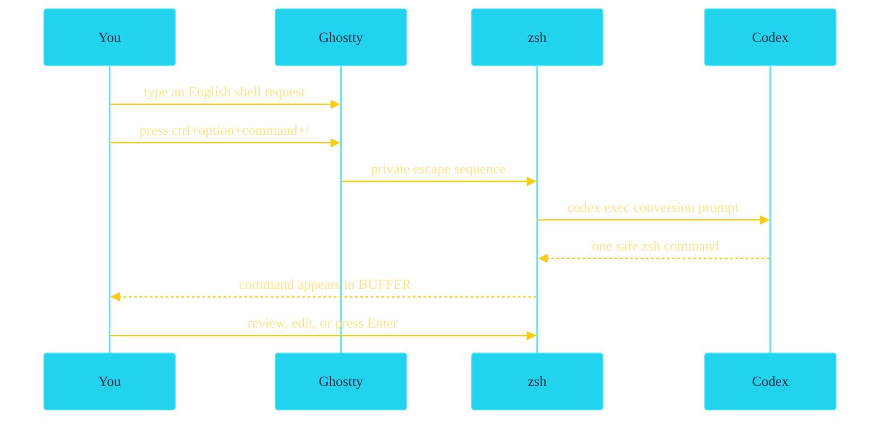

Codex NL-to-Shell
=================

Type English. Press the shortcut. Review the command.

```text
╭─ ghostty ~/work/code/python/ai_tools
╰─$ find the 20 largest markdown files under this repo

        press ctrl+option+command+/

╭─ ghostty ~/work/code/python/ai_tools
╰─$ fd -e md -x du -h {} | sort -hr | head -20
```

The generated command is inserted into your shell prompt. It is not executed until you press Enter.

<!-- end_slide -->

Live Sequence
=============



<!-- end_slide -->

Step 1: Ghostty Captures The Shortcut
=====================================

File: `~/.config/ghostty/config`

```text
# Codex NL-to-shell: Ctrl+Option+Command+/
keybind = ctrl+opt+cmd+/=text:\x1b[999;1u
```

What this means:

```text
ctrl+option+command+/  ->  ESC [999;1u
```

Ghostty turns the macOS key chord into a private terminal escape sequence.

<!-- end_slide -->

Step 2: zsh Loads The Widget
============================

File: `~/.zshrc`

```zsh
export ZSH="$HOME/.zsh"

# Codex NL-to-shell widget; keep last so it wins final keymap order.
[[ -r "$ZSH/widgets/codex-nl-shell.zsh" ]] && source "$ZSH/widgets/codex-nl-shell.zsh"
```

Why it is loaded last:

```text
other plugins bind keys first
codex-nl-shell binds last
the shortcut wins final keymap order
```

<!-- end_slide -->

Step 3: zle Binds The Escape Sequence
=====================================

File: `~/.zsh/widgets/codex-nl-shell.zsh`

```zsh
zle -N codex-nl-shell _codex_nl_shell

_codex_nl_shell_bindkeys() {
  local seq=$'\e[999;1u'

  bindkey "$seq" codex-nl-shell
  bindkey -M emacs "$seq" codex-nl-shell 2>/dev/null
  bindkey -M viins "$seq" codex-nl-shell 2>/dev/null
  bindkey -M vicmd "$seq" codex-nl-shell 2>/dev/null
}
```

The same shortcut works in emacs mode, vi insert mode, and vi command mode.

<!-- end_slide -->

Step 4: The Widget Reads Your Prompt
====================================

File: `~/.zsh/widgets/codex-nl-shell.zsh`

Plain-English version:

```text
1. Save whatever is currently typed at the prompt.
2. Use CODEX_NL_MODEL if set, otherwise use gpt-5.4-mini.
3. Treat the current prompt text as the English request.
4. Trim extra spaces from the beginning and end.
5. Optionally remove a leading "# " if you typed the request as a shell comment.
6. If nothing is left, show a message and stop.
```

```zsh
original_buffer="$BUFFER"
codex_model="${CODEX_NL_MODEL:-gpt-5.4-mini}"
query="$BUFFER"
query="${query#"${query%%[![:space:]]*}"}"
query="${query%"${query##*[![:space:]]}"}"
query="${query#\# }"

if [[ -z "$query" ]]; then
  zle -M "codex: type a shell request first"
  return 0
fi
```

The `# ` step is optional convenience, not core logic. It lets you type `# find large files` safely at a shell prompt.

<!-- end_slide -->

Step 5: Codex Generates One Command
===================================

File: `~/.zsh/widgets/codex-nl-shell.zsh`

```zsh
codex exec \
  --ephemeral \
  --sandbox read-only \
  --skip-git-repo-check \
  -m "$codex_model" \
  --cd "$PWD" \
  -o "$tmp" \
  "Convert this natural language request into one safe zsh command for macOS/Linux. Return only the command, with no Markdown, no explanation, and no execution. Prefer rg, fd, bat, zoxide, and safe read-only commands when they fit. Request: $query" \
  >/dev/null 2>"$err"
```

Important guardrails:

```text
ephemeral session
read-only sandbox
current directory context
command only, no explanation
```

<!-- end_slide -->

Step 6: zsh Replaces The Buffer
===============================

File: `~/.zsh/widgets/codex-nl-shell.zsh`

Plain-English version:

```text
1. Read the command Codex wrote into the temp file.
2. Delete the temp output and error files.
3. Normalize line endings and trim extra whitespace.
4. Strip accidental Markdown fences if Codex included them.
5. Replace the current zsh prompt text with the command.
6. Move the cursor to the end and tell you to review before Enter.
```

```zsh
generated="$(<"$tmp")"
command rm -f "$tmp" "$err"

generated="${generated//$'\r'/}"
generated="${generated#"${generated%%[![:space:]]*}"}"
generated="${generated%"${generated##*[![:space:]]}"}"
generated="${generated#\`\`\`zsh$'\n'}"
generated="${generated#\`\`\`sh$'\n'}"
generated="${generated#\`\`\`bash$'\n'}"
generated="${generated#\`\`\`$'\n'}"
generated="${generated%$'\n'\`\`\`}"

BUFFER="$generated"
CURSOR=${#BUFFER}
zle -M "codex: command ready, review before Enter"
zle reset-prompt
```

The final safety step is human review. The command is visible before it runs.
